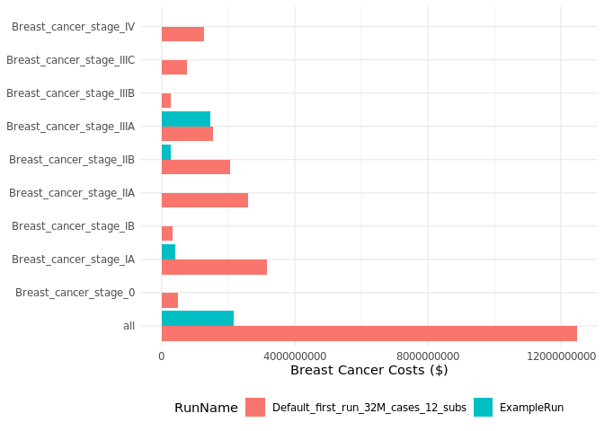

# openmpp

<!-- badges: start -->

[](https://lifecycle.r-lib.org/articles/stages.html#stable)
[](https://github.com/mattwarkentin/openmpp/actions/workflows/R-CMD-check.yaml)
<!-- badges: end -->

The goal of `openmpp` is to provide a programmatic interface to the
OpenM++ API directly from R to simplify creating scenarios, running
models, and gathering results for further processing.

## Installation (R Package)

You can install the development version of `openmpp` from [GitHub](https://github.com/) with:

``` r
# install.packages("remotes")
remotes::install_github("mattwarkentin/openmpp")
```

## Installation (OpenM++)

If you do not have access to an existing OpenM++ server, it is possible to run a server on your workstation, which the `openmpp` package can connect to.

### Download

To install OpenM++, download and unzip the "source code and binaries" appropriate for your system from [GitHub](https://github.com/openmpp/main/releases/latest)

NOTE: Windows may allow you to view the contents of the zip file without extracting, however the files must be extracted for proper function.

### Running on Windows

Enter the OpenM++ directory using File Explorer. Right-click inside the folder and select "Open in Terminal".

In the new Windows Terminal window, type in the following command:
``` cmd
.\bin\oms.exe
```
This will start the process responsible for running the web service and running models. Take note of the address listed after "Listen at:", as this will be the `OPENMPP_LOCAL_URL` to be used with the R package.

### Running on MacOS

Open a new MacOS Terminal window (either by using Spotlight search or by navigating to "Applications" and then "Utilities" in Finder).

After unzipping the downloaded file in Finder, drag the folder into the terminal and press Enter. This will change your active directory to the OpenM++ folder.

Type the following command into the terminal:
``` bash
bin/oms
```
Like the Windows installation, the web service will begin running and present the "Listen at:" address for use in the R package.


## Usage

The `openmpp` package contains many functions that provide access to
nearly every OpenM++ API endpoint. However, users will typically only
use a smaller set of functions for most common tasks.

### User Authentication

Each user is required to set their local or remote host address (i.e.,
URL) for the OpenM++ API in their global or project-specific `.Renviron`
file in order for the `openmpp` package to authenticate and communicate
with the API on behalf of the user.

For an API running locally, set the following environment variable in
your `.Renviron` file:

    OPENMPP_LOCAL_URL=http://localhost:XXXX

Where `XXXX` is the four digits corresponding to your specific local
host address. If you aren’t sure of your host address, you may contact
the OpenM++ administrator to retrieve this information.

For an API running remotely, set the following environment variables in
your `.Renviron` file:

    OPENMPP_REMOTE_URL=...
    OPENMPP_REMOTE_USER=...
    OPENMPP_REMOTE_PWD=...

Note that the URL, user name, and password should be kept confidential
and not committed into version control (e.g., git).

Once the environment variables are set, users may register a local or
remote API connection in their R scripts.

``` r
library(openmpp)
use_OpenMpp_local()
```

Or,

``` r
library(openmpp)
use_OpenMpp_remote()
```

see `?use_OpenMpp_local` or `?use_OpenMpp_remote` for more information.

### Main Functions

- Functions for accessing tables of models, worksets, or model runs

  - `get_models()`

  - `get_worksets()` / `get_scenarios()`

  - `get_model_runs()` / `get_runs()`

- Functions for creating new worksets or scenarios

  - `create_scenario()` / `create_workset()`

- Functions for loading models, worksets, or model runs

  - `load_model()`

  - `load_workset()` / `load_scenario()`

  - `load_model_run()` / `load_run()`

  - `load_model_runs()` / `load_runs()`

- Functions for deleting worksets or model runs

  - `delete_workset()` / `delete_scenario()`

  - `delete_model_run()` / `delete_run()`

### Models, Scenarios, Runs, and RunSets

There are 4 main classes you will work with when using the `openmpp`
package: `OpenMppModel`, `OpenMppWorkset`, `OpenMppModelRun`, and
`OpenMppModelRunSet`. Each of these are `R6` classes. `R6` is an
encapsulated object-oriented programming system for R. Use the
`load_*()` set of functions to load a model, workset/scenario, model
run, or set of model runs into memory.

Instances of each of these 4 classes have methods and fields associated
with them. You can access public methods and fields using the standard
`$` subset operator (e.g., `obj$action()` or `obj$field`)

### Example

Here we will work through a very simple example of creating a new
scenario, extracting parameters to change, changing parameters, running
the model, and extracting results.

``` r
library(openmpp)
library(dplyr)
library(ggplot2)

use_OpenMpp_remote()
```

Let’s see what models are available:

``` r
get_models()
#> # A tibble: 34 × 7
#>    ModelId Name              Digest  Type Version CreateDateTime DefaultLangCode
#>      <int> <chr>             <chr>  <int> <chr>   <chr>          <chr>          
#>  1     101 OncoSim-allcance… 24892…     0 3.6.4.4 2024-08-09 16… EN             
#>  2     101 OncoSim-breast    e1f97…     0 3.6.4.4 2024-08-09 15… EN             
#>  3     101 OncoSim-cervical  a9583…     0 3.6.4.4 2024-08-09 15… EN             
#>  4     101 OncoSim-colorect… 0636a…     0 3.6.4.4 2024-08-09 15… EN             
#>  5     101 OncoSim-gmm       5dc68…     0 3.6.4.4 2024-08-09 15… EN             
#>  6     101 OncoSim-lung      de02f…     0 3.6.4.4 2024-08-09 16… EN             
#>  7     101 OncoSim-allcance… a746a…     0 3.6.3.9 2024-03-19 13… EN             
#>  8     101 OncoSim-breast    4f35e…     0 3.6.3.9 2024-03-19 12… EN             
#>  9     101 OncoSim-cervical  c851a…     0 3.6.3.9 2024-03-19 13… EN             
#> 10     101 OncoSim-colorect… 52248…     0 3.6.3.9 2024-03-19 13… EN             
#> # ℹ 24 more rows
```

We can now see what worksets and model runs exist for a given model.

``` r
get_worksets('RiskPaths')
#> # A tibble: 1 × 10
#>   ModelName ModelDigest     ModelVersion ModelCreateDateTime Name  BaseRunDigest
#>   <chr>     <chr>           <chr>        <chr>               <chr> <chr>        
#> 1 RiskPaths d90e1e9a49a06d… 3.0.0.0      2024-02-16 20:32:4… Defa… ""           
#> # ℹ 4 more variables: IsReadonly <lgl>, UpdateDateTime <chr>,
#> #   IsCleanBaseRun <lgl>, Txt <list>
```

``` r
get_runs('RiskPaths')
#> # A tibble: 1 × 15
#>   ModelName ModelDigest          ModelVersion ModelCreateDateTime Name  SubCount
#>   <chr>     <chr>                <chr>        <chr>               <chr>    <int>
#> 1 RiskPaths d90e1e9a49a06d972ec… 3.0.0.0      2024-02-16 20:32:4… Risk…        1
#> # ℹ 9 more variables: SubStarted <int>, SubCompleted <int>,
#> #   CreateDateTime <chr>, Status <chr>, UpdateDateTime <chr>, RunId <int>,
#> #   RunDigest <chr>, ValueDigest <chr>, RunStamp <chr>
```

Now we can load the `RiskPaths` model to inspect.

``` r
rp <- load_model('RiskPaths')
rp
#> ── OpenM++ Model ───────────────────────────────────────────────────────────────
#> → ModelName: RiskPaths
#> → ModelVersion: 3.0.0.0
#> → ModelDigest: d90e1e9a49a06d972ecf1d50e684c62b
```

We will now load the `Default` set of input parameters for the RiskPaths
model.

``` r
rp_default <- load_scenario('RiskPaths', 'Default')
rp_default
#> ── OpenM++ Workset ─────────────────────────────────────────────────────────────
#> → ModelName: RiskPaths
#> → ModelVersion: 3.0.0.0
#> → ModelDigest: d90e1e9a49a06d972ecf1d50e684c62b
#> → WorksetName: Default
#> → BaseRunDigest:
```

Finally, we will load the base run for the RiskPaths model.

``` r
baserun_digest <- rp$ModelRuns$RunDigest[[1]]
rp_baserun <- load_run('RiskPaths', baserun_digest)
rp_baserun
#> ── OpenM++ ModelRun ────────────────────────────────────────────────────────────
#> → ModelName: RiskPaths
#> → ModelVersion: 3.0.0.0
#> → ModelDigest: d90e1e9a49a06d972ecf1d50e684c62b
#> → RunName: RiskPaths_Default
#> → RunDigest: 134517d057d2008d01c9dbc418247ae3
```

We will create a new scenario based on the parameters from the
`RiskPaths_Default` model run.

``` r
create_scenario('RiskPaths', 'MyNewScenario', baserun_digest)
```

We will load the new scenario, copy over the `AgeBaselinePreg1`
parameter from the base run.

``` r
my_scenario <- load_scenario('RiskPaths', 'MyNewScenario')
```

Let’s reduce the fertility rate by 10% across all age groups…

``` r
my_scenario$copy_params('AgeBaselinePreg1')
```

``` r
half_rate <- my_scenario$Parameters$AgeBaselinePreg1

half_rate <-
  half_rate |> 
  mutate(across(-sub_id, \(x) x * 0.9))

my_scenario$Parameters$AgeBaselinePreg1 <- half_rate
```

We will now run the model and give it the name `'ExampleRun'`. We use
the `wait = TRUE` flag to make sure we want for the model run to finish
before returning to our R session. We use `progress = FALSE` to avoid
printing progress bars in this document. Note that model runs may take a
long time when the number of simulation cases is large.

``` r
my_scenario$ReadOnly <- TRUE
my_scenario$run('ExampleRun', wait = TRUE, progress = FALSE)
```

Note that we can use the `opts` argument and the `opts_run()` function
to configure our run. By default, models are run with 5,000 simulation
cases and 12 SubValues. This allows for quick model runs and faster
iteration, but users will want to increase the number of simulation
cases when performing a full model run.

Now that our model run is complete, let’s load it into memory.

``` r
example_run <- load_run('RiskPaths', 'ExampleRun')
example_run
#> ── OpenM++ ModelRun ────────────────────────────────────────────────────────────
#> → ModelName: RiskPaths
#> → ModelVersion: 3.0.0.0
#> → ModelDigest: d90e1e9a49a06d972ecf1d50e684c62b
#> → RunName: ExampleRun
#> → RunDigest: 204a176d2c10350a58d7b3ba9cca235b
```

We can now extract an output table from the `Tables` field in the model
run object (`example_run$Tables`).

``` r
example_run$Tables$T06_BirthsByUnion
#> # A tibble: 7 × 3
#>   expr_name Dim0                   expr_value
#>   <chr>     <chr>                       <dbl>
#> 1 Expr0     US_NEVER_IN_UNION         1205.  
#> 2 Expr0     US_FIRST_UNION_PERIOD1    2944.  
#> 3 Expr0     US_FIRST_UNION_PERIOD2     333.  
#> 4 Expr0     US_AFTER_FIRST_UNION        10.0 
#> 5 Expr0     US_SECOND_UNION             72.0 
#> 6 Expr0     US_AFTER_SECOND_UNION        1.00
#> 7 Expr0     all                       4565.
```

Great, we have created a new scenario, modified some parameters, ran the
model, and extracted output tables. In this last step, we will load
multiple model runs into memory to compare them.

``` r
rp_runs <- load_runs('RiskPaths', rp$ModelRuns$RunDigest)
rp_runs
#> ── OpenM++ ModelRunSet ─────────────────────────────────────────────────────────
#> → ModelName: RiskPaths
#> → ModelVersion: 3.0.0.0
#> → ModelDigest: d90e1e9a49a06d972ecf1d50e684c62b
#> → RunNames: [RiskPaths_Default, ExampleRun]
#> → RunDigests: [134517d057d2008d01c9dbc418247ae3, 204a176d2c10350a58d7b3ba9cca235b]
```

We will extract a new table from both models. Note that an extra column,
`RunName` is added to indicate which model run the output table data
corresponds to.

``` r
births <- rp_runs$Tables$T06_BirthsByUnion
births
#> # A tibble: 14 × 4
#>    RunName           expr_name Dim0                   expr_value
#>    <chr>             <chr>     <chr>                       <dbl>
#>  1 RiskPaths_Default Expr0     US_NEVER_IN_UNION         1285   
#>  2 RiskPaths_Default Expr0     US_FIRST_UNION_PERIOD1    2986   
#>  3 RiskPaths_Default Expr0     US_FIRST_UNION_PERIOD2     293   
#>  4 RiskPaths_Default Expr0     US_AFTER_FIRST_UNION        11   
#>  5 RiskPaths_Default Expr0     US_SECOND_UNION             57   
#>  6 RiskPaths_Default Expr0     US_AFTER_SECOND_UNION        1   
#>  7 RiskPaths_Default Expr0     all                       4633   
#>  8 ExampleRun        Expr0     US_NEVER_IN_UNION         1205.  
#>  9 ExampleRun        Expr0     US_FIRST_UNION_PERIOD1    2944.  
#> 10 ExampleRun        Expr0     US_FIRST_UNION_PERIOD2     333.  
#> 11 ExampleRun        Expr0     US_AFTER_FIRST_UNION        10.0 
#> 12 ExampleRun        Expr0     US_SECOND_UNION             72.0 
#> 13 ExampleRun        Expr0     US_AFTER_SECOND_UNION        1.00
#> 14 ExampleRun        Expr0     all                       4565.
```

We can even plot this using `ggplot2`! Note that the number of
simulation cases for `ExampleRun` is **low** so the results are not to
be trusted! This is only for demonstration purposes.

``` r
births |> 
  ggplot(aes(Dim0, expr_value, fill = RunName)) +
  geom_col(position = position_dodge()) +
  labs(x = NULL, y = 'Number of births by union') +
  coord_flip() +
  theme_minimal() +
  theme(legend.position = 'bottom')
```



When we are sure we no longer need a scenario or model run, we can use
`delete_scenario()` or `delete_run()` to clean things up!

## Code of Conduct

Please note that the `openmpp` project is released with a [Contributor
Code of
Conduct](https://contributor-covenant.org/version/2/1/CODE_OF_CONDUCT.html).
By contributing to this project, you agree to abide by its terms.
