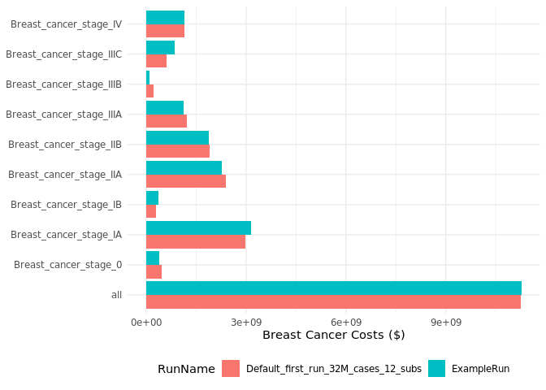

# oncosimx

<!-- badges: start -->

[](https://lifecycle.r-lib.org/articles/stages.html#experimental)
[](https://github.com/oncology-outcomes/oncosimx/actions/workflows/R-CMD-check.yaml)
<!-- badges: end -->

The goal of `oncosimx` is to provide a programmatic interface to the
OncoSimX web-based platform directly from R to simplify creating
scenarios, running models, and gathering results for further processing.

## Installation

You can install the development version of `oncosimx` from
[GitHub](https://github.com/) with:

``` r
# install.packages("remotes")
remotes::install_github("oncology-outcomes/oncosimx")
```

## Usage

The `oncosimx` package contains many functions that provide access to
nearly every OpenM++ API endpoint. However, users will typically only
use a smaller set of functions for most tasks.

### Main Functions

- Functions for accessing tables of models, worksets, or model runs

  - `get_models()`

  - `get_worksets()` / `get_scenarios()`

  - `get_model_runs()` / `get_runs()`

- Functions for creating new worksets or scenarios

  - `create_scenario()` / `create_workset()`

- Functions for loading models, worksets, or model runs

  - `load_model()`

  - `load_workset()` / `load_scenario()`

  - `load_model_run()` / `load_run()`

- Functions for deleting worksets or model runs

  - `delete_workset()` / `delete_scenario()`

  - `delete_model_run()` / `delete_run()`

### Models, Scenarios, Runs, and RunSets

There are 4 main classes you will work with when using the `oncosimx`
package: `OncoSimXModel`, `OncoSimXWorkset`, `OncoSimXModelRun`, and
`OncoSimXModelRunSet`. Each of these are `R6` classes. `R6` is an
encapsulated object-oriented programming system for R. Use the
`load_*()` set of functions to load a model, workset/scenario, model
run, or set of model runs into memory.

Instances of each of these 4 classes have methods and fields associated
with them. You can access methods and fields using the `$` subset
operator (e.g., `obj$action()` or `obj$field`)

### Example

Here we will work through a very simple example of creating a new
scenario, extracting parameters to change, running the model, and
extracting results. In this example we do not actually change any
parameters, but users can edit the extracted CSV files and use
`workset$upload_params()` to upload changed parameters.

``` r
library(oncosimx)
library(ggplot2)
```

Let’s see what models are available:

``` r
get_models()
#> # A tibble: 9 × 7
#>   ModelId Name               Digest  Type Version CreateDateTime DefaultLangCode
#>     <int> <chr>              <chr>  <int> <chr>   <chr>          <chr>          
#> 1     101 OncoSimX-allcance… ce674…     0 3.6.1.5 2023-06-13 16… EN             
#> 2     101 OncoSimX-breast    528f9…     0 3.6.1.5 2023-06-13 15… EN             
#> 3     101 OncoSimX-cervical  30246…     0 3.6.1.5 2023-06-13 16… EN             
#> 4     101 OncoSimX-colorect… b275d…     0 3.6.1.5 2023-06-13 16… EN             
#> 5     101 OncoSimX-gmm       e83b4…     0 3.6.1.5 2023-06-13 16… EN             
#> 6     101 OncoSimX-lung      eeb24…     0 3.6.1.5 2023-06-13 16… EN             
#> 7     101 GMM                02614…     1 1.1.2.0 2022-03-23 10… EN             
#> 8     101 HPVMM              0636a…     1 1.9.2.0 2023-03-20 11… EN             
#> 9     101 RiskPaths          d90e1…     0 3.0.0.0 2022-03-07 23… EN
```

We can now see what worksets and model runs exist for a given model.

``` r
get_worksets('OncoSimX-breast')
#> # A tibble: 2 × 11
#>   ModelName     ModelDigest ModelVersion ModelCreateDateTime Name  BaseRunDigest
#>   <chr>         <chr>       <chr>        <chr>               <chr> <chr>        
#> 1 OncoSimX-bre… 528f94c152… 3.6.1.5      2023-06-13 15:54:0… Defa… ""           
#> 2 OncoSimX-bre… 528f94c152… 3.6.1.5      2023-06-13 15:54:0… MyNe… "e588fec0286…
#> # ℹ 5 more variables: IsReadonly <lgl>, UpdateDateTime <chr>,
#> #   IsCleanBaseRun <lgl>, Txt <list<tibble[,3]>>, Param <list>
```

``` r
get_runs('OncoSimX-breast')
#> # A tibble: 2 × 20
#>   ModelName       ModelDigest    ModelVersion ModelCreateDateTime Name  SubCount
#>   <chr>           <chr>          <chr>        <chr>               <chr>    <int>
#> 1 OncoSimX-breast 528f94c1525c9… 3.6.1.5      2023-06-13 15:54:0… Defa…       12
#> 2 OncoSimX-breast 528f94c1525c9… 3.6.1.5      2023-06-13 15:54:0… Exam…       12
#> # ℹ 14 more variables: SubStarted <int>, SubCompleted <int>,
#> #   CreateDateTime <chr>, Status <chr>, UpdateDateTime <chr>, RunDigest <chr>,
#> #   ValueDigest <chr>, RunStamp <chr>, Txt <list>, Opts <list>, Param <list>,
#> #   Table <list>, Entity <list>, Progress <list>
```

Now we can load the `OncoSimX-breast` model to inspect.

``` r
breast <- load_model('OncoSimX-breast')
breast
#> ── OncoSimX Model ──────────────────────────────────────────────────────────────
#> → ModelName: OncoSimX-breast
#> → ModelDigest: 528f94c1525c994b010d84507ed7903f
#> → ModelVersion: 3.6.1.5
```

We will now load the `Default` set of input parameters for the Breast
model.

``` r
breast_default <- load_scenario('OncoSimX-breast', 'Default')
breast_default
#> ── OncoSimX Workset ────────────────────────────────────────────────────────────
#> → ModelName: OncoSimX-breast
#> → ModelDigest: 528f94c1525c994b010d84507ed7903f
#> → ModelVersion: 3.6.1.5
#> → WorksetName: Default
#> → BaseRunDigest:
```

Finally, we will load the base run for the Breast model.

``` r
baserun_digest <- breast$run_list$RunDigest[[1]]
breast_baserun <- load_run('OncoSimX-breast', baserun_digest)
breast_baserun
#> ── OncoSimX ModelRun ───────────────────────────────────────────────────────────
#> → ModelName: OncoSimX-breast
#> → ModelDigest: 528f94c1525c994b010d84507ed7903f
#> → ModelVersion: 3.6.1.5
#> → RunName: Default_first_run_32M_cases_12_subs
#> → RunDigest: e588fec0286ad7cacb1cdb32f947898a
```

We will create a new scenario based on the parameters from the
`Default_first_run_32M_cases_12_subs` model run.

``` r
create_scenario('OncoSimX-breast', 'MyNewScenario', baserun_digest)
```

We will load the new scenario, copy over the `ProvincesOfInterest`
parameter from the base run and extract it to a CSV file for editing.

``` r
new_scenario <- load_scenario('OncoSimX-breast', 'MyNewScenario')
new_scenario$copy_param('ProvincesOfInterest')
new_scenario$extract_param('ProvincesOfInterest')
```

We didn’t make any changes to the parameters, but we will run the model
anyway. We will give it the name `'ExampleRun'`. We use the
`wait = TRUE` flag to make sure we want for the model run to finish
before returning to our R session. Note that model runs may take a long
time.

``` r
new_scenario$run('ExampleRun', wait = TRUE)
```

Now that our model run is complete, lets load it into memory.

``` r
example_run <- load_run('OncoSimX-breast', 'ExampleRun')
example_run
#> ── OncoSimX ModelRun ───────────────────────────────────────────────────────────
#> → ModelName: OncoSimX-breast
#> → ModelDigest: 528f94c1525c994b010d84507ed7903f
#> → ModelVersion: 3.6.1.5
#> → RunName: ExampleRun
#> → RunDigest: d9f62bf0bd4f1a80b95daa4338b5d001
```

We can now extract an output table from this model run using
`$get_table()`.

``` r
example_run$get_table('Breast_Cancer_Cases_Table')
#> # A tibble: 8,177 × 4
#>    expr_name                        Province                   Year expr_value  
#>    <chr>                            <chr>                     <dbl> <chr>       
#>  1 Incidence_of_i_x_d_DCIS_combined Newfoundland_and_Labrador  2015 0           
#>  2 Incidence_of_i_x_d_DCIS_combined Newfoundland_and_Labrador  2016 0           
#>  3 Incidence_of_i_x_d_DCIS_combined Newfoundland_and_Labrador  2017 0           
#>  4 Incidence_of_i_x_d_DCIS_combined Newfoundland_and_Labrador  2018 0           
#>  5 Incidence_of_i_x_d_DCIS_combined Newfoundland_and_Labrador  2019 0           
#>  6 Incidence_of_i_x_d_DCIS_combined Newfoundland_and_Labrador  2020 0           
#>  7 Incidence_of_i_x_d_DCIS_combined Newfoundland_and_Labrador  2021 1722.898548…
#>  8 Incidence_of_i_x_d_DCIS_combined Newfoundland_and_Labrador  2022 0           
#>  9 Incidence_of_i_x_d_DCIS_combined Newfoundland_and_Labrador  2023 0           
#> 10 Incidence_of_i_x_d_DCIS_combined Newfoundland_and_Labrador  2024 0           
#> # ℹ 8,167 more rows
```

Great, we have created a new scenario, extracted some parameters to
potentially modify, ran the model, and extracted output tables. In this
last step, we will load multiple model runs into memory to compare them.

``` r
breast_runs <- load_runs('OncoSimX-breast', breast$run_list$RunDigest)
breast_runs
#> ── OncoSimX ModelRunSet ────────────────────────────────────────────────────────
#> → ModelName: OncoSimX-breast
#> → ModelDigest: 528f94c1525c994b010d84507ed7903f
#> → ModelVersion: 3.6.1.5
#> → RunNames: [Default_first_run_32M_cases_12_subs, ExampleRun]
#> → RunDigests: [e588fec0286ad7cacb1cdb32f947898a, d9f62bf0bd4f1a80b95daa4338b5d001]
```

We will extract a new table from both models. Note that an extra column,
`RunName` is added to indicate which model run the output table data
corresponds to.

``` r
cost_bystage <- breast_runs$get_table('Breast_Cancer_Cost_ByStage_Table')
cost_bystage
#> # A tibble: 80 × 4
#>    RunName                             expr_name            Stage     expr_value
#>    <chr>                               <chr>                <chr>          <dbl>
#>  1 Default_first_run_32M_cases_12_subs Total_treatment_cost Breast_c…    4.74e 8
#>  2 Default_first_run_32M_cases_12_subs Total_treatment_cost Breast_c…    2.98e 9
#>  3 Default_first_run_32M_cases_12_subs Total_treatment_cost Breast_c…    2.98e 8
#>  4 Default_first_run_32M_cases_12_subs Total_treatment_cost Breast_c…    2.40e 9
#>  5 Default_first_run_32M_cases_12_subs Total_treatment_cost Breast_c…    1.90e 9
#>  6 Default_first_run_32M_cases_12_subs Total_treatment_cost Breast_c…    1.23e 9
#>  7 Default_first_run_32M_cases_12_subs Total_treatment_cost Breast_c…    2.18e 8
#>  8 Default_first_run_32M_cases_12_subs Total_treatment_cost Breast_c…    6.07e 8
#>  9 Default_first_run_32M_cases_12_subs Total_treatment_cost Breast_c…    1.16e 9
#> 10 Default_first_run_32M_cases_12_subs Total_treatment_cost all          1.13e10
#> # ℹ 70 more rows
```

We can even plot this using `ggplot2`!

``` r
cost_bystage |> 
  ggplot(aes(Stage, expr_value, fill = RunName)) +
  geom_col(position = position_dodge()) +
  labs(x = NULL, y = 'Breast Cancer Costs ($)') +
  coord_flip() +
  theme_minimal() +
  theme(legend.position = 'bottom')
```



When we are sure we no longer need a scenario or model run, we can use
`delete_scenario()` or `delete_run()` to clean things up!

## Code of Conduct

Please note that the `oncosimx` project is released with a [Contributor
Code of
Conduct](https://contributor-covenant.org/version/2/1/CODE_OF_CONDUCT.html).
By contributing to this project, you agree to abide by its terms.
